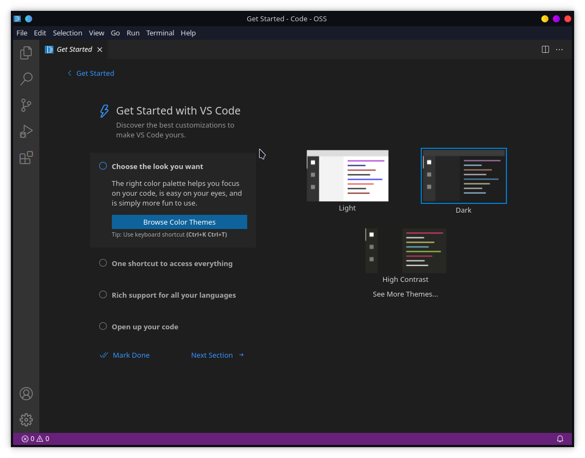
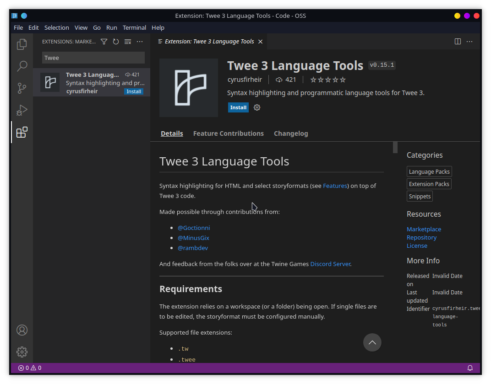
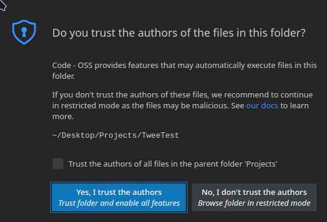
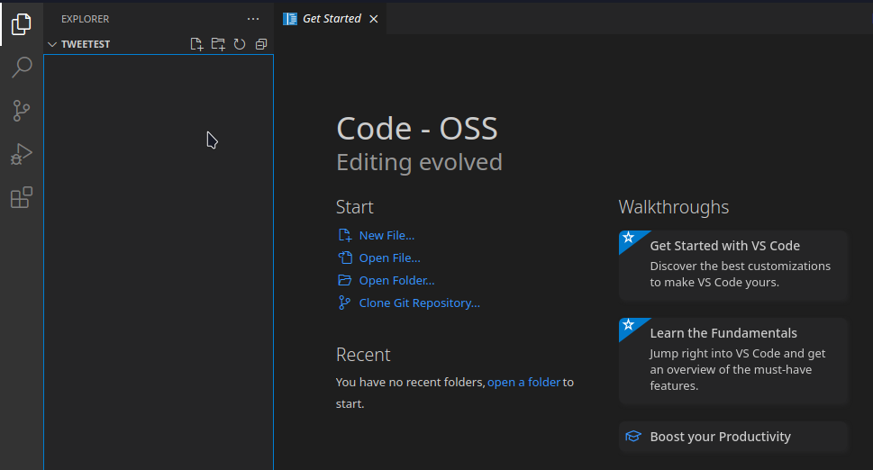
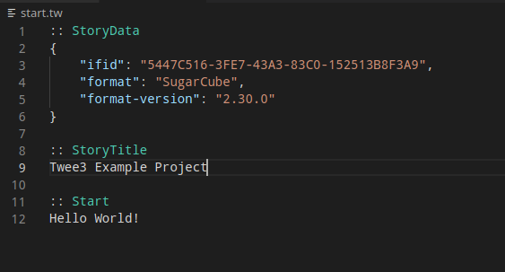

# Getting Started
So you think you might want to use the trifecta of:  
 - TweeGo (Twee Compiler)  
 - Visual Studio Code (Editor)  
 - Twee3-Language-Tools  
to write your Twine stories? This document will hopefully get you started on that.  
  
Also, think about joining the Twine Games Discord server where people who use both this setup and the official Twinery application hang out: https://discord.gg/WWU8wPq8z9

## What is all this?
Firstly, it is probably a good idea to give you a better idea of what these three separate things are.  
(We're going to assume you have some idea what Twine is, the official application at https://twinery.org/ )  
  
The first difference, even before we start using the programs, is that a Twine project when using these is made up of loose files. These are simply text files with some syntax.  
 - Note: This does mean that it is trivial to back these files up with whatever backup programs you use.
These text files are called *Twee* files (because they're written in the Twee syntax), and hold the content of passages. There can be more than one passage per Twee file, but you can also split them up as you want.  
For example (this file might be named `main_intro.tw`, where `.tw` is the file extension that twee files use!):
```twee
:: Introduction
In a land far away, there lay a young child looking up at the stars.

[[Continue->CharacterCreation]]

:: CharacterCreation
There are no options for creating your character.
```
The `::` simply signifying the beginning of a passage, and the text directly after it being the name of the passage. The rest is just like the passage content that you would enter into the official Twine program, with whatever story format you prefer using.
  
**TweeGo**: This is a program written by the same author of SugarCube (a popular Story Format for Twine) which transforms these Twee (`.tw`) files (and story JavaScript/CSS) into the resulting playable `.html` file. This is exactly what you'd get from the Twine application.  
 - Note: You could actually skip using Visual Studio Code and use whatever text editor you want with TweeGo, but the Twee-3 Language Tools extension provides nice features for them.    

**Visual Studio Code**: This is a fancy text editor, essentially. It is made by Microsoft, and is a pretty popular editor for programming. Thankfully, it can also provide features like spellchecking (if you install the right extensions), and more; so it works quite well as even a general use editor.  
  
**Twee-3 Language Tools (T3LT)**: This is an extension for Visual Studio Code (it provides functionality for it) that makes Twee files a lot nicer to use in Visual Studio Code. This provides syntax highlighting for several common formats, a variety of ways that check for mistakes in writing macros/passages (most notably in SugarCube), and more.

## Who should use this?
Switching over to VSCode + Tweego + T3LT can be a bit of jump if you're used to the Twine program, but can provide several benefits, and tries avoiding loss of features.
- Similar/Same: 
  - (T3LT) There is a graphical passage view (interconnected passages views) like in Twinery, but it is missing a few features since we primarily focus on changing (such as adding and removing passages) within the main text editor rather than the graph.
  - (TweeGo): Use the same formats that the Twinery applications supports
  - (All 3): Both are pretty cross platform, so you can use them on Windows/Mac/Linux/etc.
- Improved through the use of these tools:
  - (VSC/T3LT): Handles large projects better than Twinery, though that is supposedly improving soon in Twinery.
  - (Twee): Twee files can technically be edited on a mobile phone (unlike Twinery). Though you can't use VSCode on a mobile, but it does make it easier to do some work on your stories on the go.
  - (VSC): You can have multiple views open at once, even to the same file. This can make editing easier, or doing it while also writing notes, etc.
  - (T3LT): Syntax highlighting for several formats. This makes it easier to pick up where various pieces (such as macros) are in your story.
  - (VSC): Has syntax highlighting and more complex language support for JavaScript/CSS if you are using those.
  - (T3LT): SugarCube2 only:
    - Warnings on unclosed macros
    - Warnings on unrecognized macros (it is easy to get it to recognize your own macros), this helps avoid mistypes
    - Argument validation: Checks for if your arguments are written properly, such as strings having closing quotations. This helps avoid mistypes that would only show up as an error when you ran the game.
    - Parameter validation: Helps ensure that the types you pass in are correct, so you have to spend less time debugging issues.
    - Macro documentation on hover of the macro
- Worse:
  - (T3LT): As said previously, it focuses more on textual editing, even if it does have a passages view.
  - (TweeGo): TweeGo is a terminal application. VSCode makes these easier to use for those not used to them, but this can be somewhat annoying. Hopefully we can get around this.

For many users, this provides benefits but is not major.  
For some users, who prefer a better editor for text, this can be an attractive option.  
For SugarCube users, the T3LT extension currently provides a significant amount of checking which can make avoiding bugs while writing your game easier.  
  
This might not be for you, but it can be quite nice, in this article writer's totally unbiased opinion :)  
  
Here are some screenshots:   
**Syntax Highlighting:**  
  
  
**Sidebar Passage View:** (You can also just open them as files in the normal VSCode file sidebar)  
  
  
**Story Map:**  

  
# Installation
## Visual Studio Code
The first thing that we are going to install is Visual Studio Code.  
The official website is at: https://code.visualstudio.com/  
 - Note: For Linux operating systems, your package manager likely already has a package for it.
  
Note that this is very different from *Visual Studio*, which you may have heard of before. That is far more of a heavyweight editor, and is not what you need, but the link above will bring you directly to it.  
  
This will be the editor that you use for writing your stories, and it is what is shown in the screenshots above.
You'll likely see this when you first start it up:  
  
  
You can simply set the default color theme (there are many, many, more in the VSCode extensions listing, but these are the basics it provides) and if you want you can look through those sections.  
  
## Twee3-Language-Tools
Now that we have Visual Studio Code installed, we want to install the extension. VSCode on its own is a good editor, but it would not provide much support for Twee files itself.  
In the sidebar at the left, simply click the odd square-that-is-breaking-down icon, 
   
Or, you can click on the top title bar `View` and then `Extensions`.  
  
You'll see a sidebar popup, probably with some popular or recommended extensions. You can ignore those. At the top is a search bar. Type in "Twee", and you should see a "Twee 3 Language Tools" extension with the name 'cyrusfirheir' under it.  


Simply click install. It should be pretty quick, and now it is installed (and already enabled)!  
  
## Setting up a Project
First, before we even install TweeGo, we're going to setup a project folder.  
What I usually do is have a folder (perhaps on my Desktop or in my Documents folder) that is named `Projects`, and then have folders inside of that for individual projects. Let's go with `TweeTest` for now, but you can name it whatever you want.  
So, once I've gotten my `Projects` folder with `TweeTest` inside it, I can then open the *folder* with Visual Studio Code!  
The easiest way is to just click `File` then `Open Folder`, but you can also click the first button on the sidebar (this is the file explorer) and it will have a big 'Open Folder' button.  
Simply navigate to where the `TweeTest` folder is, click on it, and open it.  
  
Now, you might see something like this:  
  
You can simply click *Yes*. This feature is mainly for people who are often working on other people's projects (since some extensions automatically execute code, though T3LT doesn't do that), but since this is our own project, we don't need to worry about that.  
  

Now we have this:  
  
Our project is empty, how sad.  
You could click that nice blue `New File` button, but let's show you how to create files when you don't have the get started pane open.  
In the image above, you'll see that next to `TWEETEST` (it makes folder name all caps there, for some reason), there's a little file icon with a plus next to it. This is invisible if you aren't hovering over the Explorer pane.  
Simply click that, and it will ask you to name your file. Let's just name it `start.tw`. Make sure to include the `.tw` extension!  
It will automatically open this file, and you could simply start typing!  
  
Though, realistically, you need a passage!  
Write:
```twee
:: Start
Hello World!
```
With TweeGo (which we'll get to!), the `Start` passage is special. I'm sure you could guess that it is the start of the story. This can be changed easily, if you want.  
Now, you might notice that at the top where the tabs are, there's a white dot next to the text `start.tw`. This indicates that it is unsaved.  
You cn click `File -> Save`, or you can simply press `Ctrl + S` (like most editors) to save it. VSCode does have options for autosaving, if you wish to have that.  
  
However, there is two things that we're missing!  
We firstly need a *StoryTitle* passage!
Simply add:
```twee
:: StoryTitle
Twee3 Example Project
```
You can change this title at any time.  
  
We also need a *StoryData* passage! This is a very special one, which TweeGo and the T3LT extension use to determine some basic information.  
```twee
:: StoryData
{
	"ifid": "<ifid here>",
	"format": "<story format here, i.e. 'SugarCube'>",
	"format-version": "<story format version here, i.e. '2.35.0'>"
}
```
Simply put this in your `start.tw` file (though it can go anywhere).  
You'll notice it says "put things here", well, we have to fill it out.  
The first is the IFID, aka Interactive Fiction Identifier. This is just a unique identifier - not your story's title! - that is standard for Twine applications (Twinery also has it, but puts it there automatically). Thankfully, T3LT provides a way to autogenerate this:  
- Remove the `<ifid here>` text (keeping the quotes!)
- Click in between the quotes so your text selection is within them
- Click `View` -> `Command Palette`, or press `Ctrl + P`
- Type "IFID"
- You'll see "Twee 3 Language Tools: Generate IFID", simply press enter.
Now you should have an IFID unique to your story (these are just GUIDs, and have enough data in that short string that they're probably unique even if there was an absurdly larger number of Twine stories!):  
  
(Note: Don't use the IFID in the screenshot! They're intended to be unique!)  
  
Alright, that was a little rough, but I think we're fine. The next is specifying what *Story Format* to use.  
If you don't know what Story Formats are, they essentially decide a lot of the syntax, look, and behavior. Twinery itself is kindof an 'engine' for these formats.  
  
These are the story formats the Twinery has (in the Change Format section).  
As it says, the default is *Harlowe 3*.  
So, if you want to use Harlowe, then write in the above:
(Note: the versions here are slightly out of date of the ones in the picture, because Twinery ships with the latest versions, while TweeGo has out of date versions. Updating them is easily done, and will probably be in another section (TODO))
```json
	"format": "Harlowe",
	"format-version": "3.1.0"
````

If you want to use SugarCube (T3LT has the most support for it!):  

```json
	"format": "SugarCube",
	"format-version": "2.30.0"
```
Chapbook:
```json
	"format": "Chapbook",
	"format-version": "1.0.0"
```

TweeGo also has support for other formats, and they can be added to it as well.  
  
Once you have that done, simply save the file. We'll be going with SugarCube-2 for this tutorial, but you should not have too many issues.  
Once saved, you may see a popup in the corner of the VSCode window for "Storyformat set to sugarcube-2". This is just T3LT informing us that it now knows what format we're using. Before, with our singular Twee file with only a very simple passage, it couldn't know what format we wanted to use.  
If you hover over the notification, it will have an X button so you can close it :)
  
Now, we could start writing more complex story now, but we should probably install TweeGo so we can actually build our story!

## TweeGo
TweeGo is an essential part of getting this all to work. You could even just use it with any text editor you want (though T3LT is currently VSCode only), but this guide doesn't cover that (though, it wouldn't be too hard to add if you wish).  
As mentioned previously, TweeGo is by the same person who made the common SugarCube story format, and is available for download from: https://www.motoslave.net/tweego/  
Scroll down to the downloads section and download the right zip file for whatever operating system you are on. If you're confused by the x64 (64-bit) and x86 (32-bit), you probably have a 64-bit computer in this day and age, and so get that one.  
(If you like his software, consider donating through his Patreon!)  
  
Once you have it downloaded, you have to extract it somewhere. Running programs from a zip can.. sometimes work, but can also have issues, and is needed for how we're going to use it. You can usually just go to the folder the file was downloaded into, right click it, and hit some button that says Extract.  
What I do is move the files it has (the `tweego` executable and the `storyformats` folder) and move them into the projects folder under their own folder, ex:
```
Projects/
  - TweeTest/
    - start.tw
  - tweego/
    - tweego
    - storyformats/
```
So the folder is right next to our projects for easy access. You could move the `tweego` folder elsewhere if you want, but that would mean you need to modify the commands we'll show next.  
  
So once you have it like that, an important thing to note is that TweeGo is a *command line program*. This means it is ran from, well, a *command line*. It doesn't have a graphical representation like your browser or visual studio code, it just outputs text.  
If you were to simply execute TweeGo by double clicking it, then (at least on Windows), you'd probably see a command line window pop up and then disappear.  
  
But, it is pretty easy to run a command line program. VSCode even provides an inbuilt terminal (essentially a command line) to input into.  
So, going back to VSCode, you can click `View` -> `Terminal` (or `Ctrl + GRAVE`)  
This will open up a little box at the bottom of your view that you can then run commands in.  
(Yours may look a bit different than my screenshots. I'm using Linux, but the essentials of what to input will be described!)  
In this, we can then type:  
**Windows:** `../tweego/tweego.exe` or `..\tweego\tweego.exe`  
**Linux/MacOS:** `../tweego/tweego`  
You should see something like this:
```bash
error: Input sources not specified.

Usage: tweego [options] sources...

  sources                  Input sources (repeatable); may consist of supported
                             files and/or directories to recursively search for
                             such files.

Options:
```
(Then a whole bunch of options). You may need to scroll up to see that.  
Now, this is actually not that complex.  
TweeGo takes a number of options for configuring it, and then a list of sources. The sources are simply a list of all the files you want to use in your game. This does make it easier to have things like Patreon-specific builds, since you can then just not include the extra content in the Public-Release builds.  
The most basic usage of tweego is like so:  
**Windows:** `../tweego/tweego.exe --output index.html start.tw`  
**Linux/MacOS:** `../tweego/tweego --output index.html ./start.w`  
- Note: (`./` simply refers to the current directory)  

This just sets the `output` flag (you can see it in that big list from before!) to the first thing after it, aka `index.html`. This will be the filename of the built version of your project, and what you can load in the browser to test!  
Then, after that, is the list of all the source files. Currently this is just our single `start.tw` file, but you can just add a space then put the name of another file after it.  
If you ran this, you should see an index.html file appear in the explorer side bar, assuming there were no errors.  
 - If you got an error, make sure you put essentially what was in the above pictures. If you still have issues, feel free to ask in the Twine Games discord linked at the top of this document, in the `#compilers` channel.  

I wouldn't recommend clicking the index.html file, since it is rather sizable because of the code that manages your Twine game. You'd see much the same output from the official Twine application.  
What you can do now, however, is go to your normal file manage and double click the index.html file. You should be able to open it in your browser, and see something like this (other formats by default look different!):  
  
  
Technically, this is now all you need! But, we'll provide some more information on common things you might want to do, so read the further sections if curious.  
Of further use, is the TweeGo documentation: https://www.motoslave.net/tweego/docs/, but this will cover some parts that are mentioned in there, as well as other useful bits.

## Nice Project Structure
When writing a larger writing project, it can be important to have a nice project structure. A common one is like so:
```
- TweeTest
  - dist/
    index.html
  - assets/
    - cool_background.png
  - src/
    - js/
      - script.js
    - css/
      - style.css
    - start.tw
    - other.tw
```
Let's go over this.  
`dist/`: This is where you put the files for distributing and/or build files. This would be where your `index.html` is put, to keep it out of the way. Some people put the `assets/` folder inside of `dist/`. Keeping a completely separate `dist` folder is nice if you use a source file version tracking program like `Git` or `Mercurial`, but isn't too important.  
`assets/`: Having a separate folder for images, audio, etc. is nice because it lets you avoid them being crowded.  
`src/`: An src folder is useful if you want to use the glob matching for easily including all the files in your folders, which is covered in a section further down the page. You'd put the sources for your game (Twee files, javascript, and css) inside of it.  
`src/js/`: Javascript files. You might not need custom JavaScript at all, but some addons for Twine use JavaScript, and so having a place to put them is nice. Keeping them separate from story files can make things cleaner.  
`src/css/`: CSS (Cascading Style Sheets) files. These are useful for adding custom styling to the page, to really make your game stand out. Keeping them separate from story files can make things cleaner.    
This is just a suggestion, and you can have your folders structured however you like.    

Another nice part is that for major story areas / arcs / parts, you could create a folder just for files that have passages related to it, to keep it organized.  

Example using all of the above: (you can include javascript and css by just adding them to the list!)
**Windows:** `../tweego/tweego.exe --output dist/index.html src/start.tw src/other.tw src/js/script.js src/css/style.css`
**Linux/MacOS:** `../tweego/tweego --output ./dist/index.html ./src/start.tw ./src/other.tw ./src/js/script.js ./src/css/style.css`

## Using more Files
The simplest way to use more files is to just add them one at a time:  
**Windows:** `../tweego/tweego.exe --output dist/index.html src/start.tw src/other.tw`    
**Linux/MacOS:** `../tweego/tweego --output ./dist/index.html ./src/start.tw ./src/other.tw`  
But, I'm imagining that you're thinking that manually adding one at a time is a chore, right?  
**Windows:** `../tweego/tweego.exe --output dist/index.html src`  
**Linux/MacOS:** `../tweego/tweego.exe --output ./dist/index.html ./src`  
This will simply include all the files in that folder, recursively.  
This is one reason why a folder just for your sources is useful.

## Converting an Existing Twine Project
So, what if you want to convert an existing Twine project into Twee files so that you can use all this?  
Thankfully, you don't have to copy and paste every single one of your passages.
  
Go to the Twine application, and click on the settings icon next to your story (in the view with the list of stories).  
Move the downloaded `.html` file to the folder you want it to be put in (so, in `Projects/TweeTest/` or wherever you want it):  
Then, we can tell TweeGo to convert that to Twee files!  
**Windows:** `../tweego/tweego.exe --output story.tw --decompile-twee3 ProjectFile.html`  
**Linux/MacOS:** `../tweego/tweego --output ./story.tw --decompile-twee3 ./ProjectFile.html`  
  
Now, all of your project's passages, code, and more should be put into the `story.tw` file.  
If you have a large project, you probably want to split that single file up into smaller files.  
Thankfully, you only have to do this decompilation step once, and you can remove the `ProjectFile.html` (or keep it as a backup if you want, but the original Twine project is still in your Twine application).  
From now on, you can usually just treat the file the same as any other Twee file and add it to your compilation. Though, the version of the Story Format might be different, but updating it should be easy.  

## Updating TweeGo Story Format
TweeGo comes with several different story formats, which you can see with `tweego.exe --list-formats`.  
Sadly, they are somewhat out of date, though for the most part not severely. Still, you may want the increased features and possible bug fixes of the newest versions.  
Thankfully updating is pretty easy.  
First, you have to download the Story Format from wherever the creator of it uploads it.
 - SugarCube: https://www.motoslave.net/sugarcube/2/ (the 'For Twine >= 2.1 & Tweego (local/offline)' option)
 - Harlowe: (unsure)
 - Chapbook: https://klembot.github.io/chapbook/use/1.2.1/format.js (You'll have to save this page, if it doesn't automatically download)  

Once you have that, go to your TweeGo folder and find the folder for the Story Format you want to update.
You can simply replace the `format.js` file (some file managers only show `format` without the extension) with the one you downloaded.